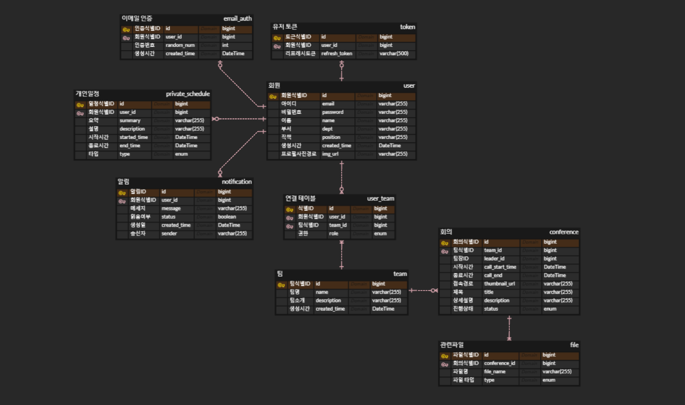

# 👋 MEFI 👋
### 팀 단위 화상회의와 다자간의 문서편집이 가능하도록 도와주는 협업툴 서비스

<br>

### 💚 MEFI 소개 및 시연 영상

<br>

### 💚 MEFI 서비스 화면

<br>

### 💚 주요 기능
- 서비스 설명 : 팀 단위 화상 통화와 다자간의 문서편집이 가능하도록 도와주는 협업툴 서비스입니다.
- 주요 기능
  - webRTC를 통해 실시간 화상 회의
  - 화상 회의 도중, 다중간의 문서 작업과 채팅으로 업무 효율을 높일 수 있음
  - 회의가 끝나면 자동으로, 작성한 문서가 저장됨. 관련 문서를 다운로드 할 수 있음.
  - 회의 예약 시, 해당 회의와 관련된 문서를 회의 상세 페이지에 업로드 및 다운로드 가능
  - 회의 예약은 팀장만 가능하며, 팀 생성 시, 팀을 생성한 사람이 팀장 권한을 가짐.

<br>

### 💚 개발 환경 
🌱 백앤드
- intellij
- spring boot 3.2.1
- spring-boot-jpa
- spring security 6.1.3
- java 17
- MySQL 8.0.36

<br>

🌱 프론트
- Visual Studio Code
- Vue3
- Node.js 20.10.0
- Vuetify
- figma

<br>

🌱 라이브러리
- openvidu 2.29.0
- Yjs 13.6.10
- Quill 1.3.7

<br>

🌱 Infra
- Docker
- Jenkins 2.426.2
- AWS EC2
- AWS S3 
- Server 20.04.6 LTS (GNU/Linux 5.15.0-1051-aws x86_64)
- Nginx 1.24.0

<br>

### 💫서비스 아키텍처 


<br>

### 💫CICD

<br>

### 💥기술 특이점
참고 자료 : https://github.com/yesfordev/homedong

💥 WebRTC(Openvidu)

> Openvidu로 할 수 있는 실시간 채팅, 화면 공유 기능 뿐만이 아니라 회의가 종료되어 세션이 끝나면 구성원들이 함께 작성한 문서를 PDF로 저장하는 등 여러 기능을 구현하였습니다. 추가적으로 여러 레이아웃 배치 구현하여 사용자가 화면을 편하게 이용할 수 있게 노력하였으며, 팀장 권한에 따라 세션을 생성하고 회의를 종료하는 등 서버에서 Openvidu api 메서드를 통해 여러 기능을 구현하였습니다.

💥 Yjs & Quill

> 한 화면에서 문서 작업을 동시에 하기 위해 CRDT 알고리즘이 필요하였으며, 이를 구현해놓은 Yjs 라이브러리와 웹 에디터인 Quill을 연동하여 동시 문서 편집 기능을 구현하였습니다. Quill에 내장된 toolbar 외에도 markdown 형식을 통해 문서를 작성할 수 있게 하였으며, Openvidu를 통한 회의가 종료되었을 경우 Quill에 저장된 내용을 PDF 파일 형식으로 변환하여 S3 storage에 업로드할 수 있게 하였습니다. 또한 문서를 작성하는 사용자의 정보를 커서에 삽입하여 구성원들이 어디에서 문서를 편집하고 있는지 확인할 수 있습니다.

💥 S3
(부광)

💥 실행
- 프로젝트 클론 
  ```
  // 원격 저장소 로컬 저장
  git clone {Github 주소}

  // 폴더 이동
  cd S10P12D204
  ```
- 프론트 로컬 실행
  ```
  // 폴더 이동
  cd front-end

  // node.js 설치
  npm install

  // 로컬 프론트 실행
  npm run dev 
  ```
- 백엔드 로컬 실행
  ```
  // 폴더 이동
  cd backend
  
  // 프로젝트 빌드
  ./gradlew clean build

  // 프로젝트 실행
  java -jar build/libs/backend-0.0.1.jar
  ```

<br>

### 👨‍👩‍👧 협업툴
- Git
- Jira
- Gerrit
- Notion
- Mattermost

<br>

### 📝 요구사항 정의서
(병조)

<br>

### 🎨 화면 설계서


<br>

### ⚡️ Git 컨벤션
⚡️제목
- 🚧 : 작업 도중 저장
- ✨ : 기능 구현
- 🎨 : 파일 구조 수정
- 🚑️ : 버그 수정
- 🧱 : 인프라 관련 작업
- 🔨 : 코드 리팩토링
- 🔧 : 포트, 환경, 세팅에 관한 수정

<br>

⚡️꼬리말
- Fixes : 이슈 수정 중 (미해결)
- Resolves : 이슈 해결 후
- Ref : 참고할 이슈
- Related to : 해당 커밋과 관련된 이슈 번호(미해결)

<br>

⚡️commit message 예시
```
✨: "추가 로그인 함수"  // 제목

로그인 API 개발          // 본문

Resolves: #123          // 꼬리말 
Ref: #456
Related to: #48, #45

issue_key               // jira 연동
issue_key #done         // jira 해당 작업 완료
```

<br>


### ⚡️ Git Flow
- Git flow 사용한 브랜치
  - master : 배포
  - develop : 개발 및 테스트
  - feature : 기능

<br>

- Git flow 사용한 브랜치
  - 개발 시, 맡은 기능 별로 develop 하위에 feature 브랜치 생성
  - 개발 완료 시, 해당 feature 브랜치를 develop에 merge한다.
  - 개발 테스트 시, develop에 파이프라인 연결하여 배포 및 테스트 작업 진행
  - 개발 완료 및 테스트 완료 시, master 브랜치로 배포 진행

<br>

- Git 브랜치 이름 컨벤션
  ```
  backend/domain/feature
  frontend/domain/feature

  예시 : be/user/login
  ```

<br>

### 🔥 Gerrit 활용
- Gerrit과 GitLab의 code review 비교
  - GitLab은 MR 요청 시, code review가 가능합니다
  - Gerrit은 commit 시점 마다 가능하며, 코드 작성자가 코드 리뷰를 원할 경우 코드 리뷰 요청을 보낼 수 있습니다.

<br>

- Gerrit을 이용한 이유
  - GitLab은 merge를 할때만 코드 리뷰를 진행하므로, 리뷰해야할 코드 양이 많습니다
    그에 비해 gerrit은 commit단위로 코드리뷰를 할 수 있어서, 리뷰해야할 코드 양이 적습니다.
  - Gerrit은 코드 리뷰 시점을 개발자가 정할 수 있습니다.

<br>

- Gerrit 사용 방법
  - jira를 GitLab과 연동
  - GitLab과 Gerrit 연동
  - Gerrit의 Repository를 clone하여 개발 작업 및 commit
  - commit한 내용은 GitLab에 자동 업로드
  - commit에 Jira issue key를 기재하면, jira에 자동 업로드

<br>

- Gerrit을 이용한 코드 리뷰 과정
  - feature 브랜치에서 작업 진행
  - 해당 작업을 완료하여 commit을 하고, 코드리뷰 요청
  - 팀원들의 코드리뷰 평가
  - 피드백으로 코드를 수정 후 다시 코드 리뷰 요청
  - 팀원들의 평가로부터 통과를 받으면, 코드를 push할 수 있습니다.

<br>

### 🐛 코드 컨벤션
🐛 프론트 코드 컨밴션

<br>

🐛 백앤드 코드 컨밴션
- File : domain infomation
- Method
  - 생성 create[domain]
  - 수정 modify [domain] [content]
  - 삭제 delete [domain] [content]
  - 조회 get [target]

<br>

### 👨‍👩‍👧 Jira
협업 및 일정, 업무 관리를 위해 Jira를 이용하였습니다. 매주 월요일 오전 회의를 통해 한 주 동안 진행할 스프린트를 계획하고, 진행할 스토리와 테스트를 해당 스프린트에 생성하여 등록하였습니다. 또한 매주 금요일 오후에 회의를 진행하여 해당 스프린트에 대한 회고를 진행하였습니다.
- Epic : 큰 도메인으로 분류
- Stroy : 사용자 관점에서 기능을 사용하는 상황을 기술
- subtask : 사용자가 사용할 기능을 개발할때 필요한 목록으로 디테일하게 기술, 소요된 시간 및 스토리포인트 할당

<br>

### 👨‍👩‍👧 Notion
개발 환경 구축에 필요한 정보, 라이브러리 및 기술 관련 링크, 회의록 작성 및 프로젝트 진행에 관련된 산출물을 기록하고 공유하는 용도로 사용하였습니다. 컨벤션 및 브랜치 전략 등 또한 노션에 기록함으로써, 모두가 항시 확인할 수 있도록 관리하였습니다.

<br>

### 👨‍👩‍👧 Scrum
매일 아침 9시에 스크럼 회의를 10분 동안 진행하며, 어제 했던 일과 오늘 진행할 업무, 발생한 이슈를 공유하는 시간을 가졌습니다. 스크럼을 통해 팀원들의 현재 상황을 파악할 수 있고, 프로젝트에 대해 꾸준히 모니터링할 수 있었습니다.

<br>

### 🎨 ERD


<br>

### 🎨 EC2 포트 정리 (현준 부광)
| 이름 | 내부 포트 | 외부 포트 |
| :-----: | :-----: | :-----: |
| Vue | 5173 | 5173 |
| SpringBoot | 8080 | 8080 |
| Jenkins | 9000 | 9000 |
| MySQL | 3306 | 3306 |
| http | 80 | ----- |
| https | 443 | ----- |
| openvidu-coturn-1 | 3478 | 3478 |

<br>

### 👨‍👩‍👧 팀원 역할
😃권현준
- DB 설계 및 구축
- 시스템 아키텍처 설계
- 인프라 구축
- 백엔드 서버 개발(팀, 일정)
- UCC 제작 및 편집

😊신영한
- DB 설계 및 구축
- Spring Security
- JWT
- Custom Exception
- 이메일 전송, 인증
- 백엔드 서버 개발 (회원, 회의, 토큰)

😘최부광
- DB 설계 및 구축
- 백엔드 서버 개발 (SSE 알림, 파일, 일정 API)
- AWS S3
- OpenVidu (BE)

😝박병조
- PM
- 발표
- 개인달력 컴포넌트 구현
- 팀 달력(주간) 컴포넌트 구현 
- 개인 일정에 대한 일일 일정표 구현
- 팀생성, 수정, 삭제, 조회, 팀원 변경, 리더 위임
- 개인 일정 생성, 수정, 삭제, 조회


😛김준수
- Figma 디자인
- 다자간 화상 회의 (Openvidu)
- 문서 공동 작업 (Yjs)
- 파일 업로드, 다운로드, 삭제, 목록 조회
- 회의 생성, 수정, 삭제, 이력 조회, 상세 정보 조회, 종료
- 404 Not Found 페이지 ✨

😀이지연
- 회원 가입
- 로그인
- 이메일 인증
- 비밀번호 찾기
- 비밀번호 변경
- 회원 정보 조회 및 수정
- 회원 탈퇴
- 안읽은 알림 전체 조회
- 단일 알림 조회
- 알림 전체 읽음 처리
- 실시간 알림 받기

<br>

### 👨‍👩‍👧 프로젝트 소감
😃권현준
- 첫 도전한 인프라에서 많은 좌절도 있었지만 성공적으로 마무리되어서 기분이 좋습니다. 프로젝트를 하면서 많은걸 얻었고 다른 팀원도 많은걸 얻어간 좋은 프로젝트이길 바라겠습니다.

😊신영한
- 처음으로 백엔드 직무를 맡아 프로젝트를 참여하게 되어 시작 전부터 많은 걱정이 있었습니다. 좋은 팀원들을 만나 걱정과 다르게 오히려 많은 배움과 성장을 할 수 있어서 좋았습니다. 또한 현재 스스로 무엇이 부족한지, 무엇을 채워야 하는지 등의 자기 성찰과 개발의 즐거움을 다시금 깨달을 수 있는 의미 있는 시간이었습니다.

😘최부광
- 여러 명이 함께하는 프로젝트는 처음이었네요. 혼자 백엔드를 맡았던 관통 프로젝트와 달리, 이번 프로젝트에서는 협업의 관점에서 많은 것을 경험할 수 있었습니다. 스스로 부족한 부분도 정말 많다는 것을 알게 되었네요 ㅎㅎㅎ 모두 고생 많았고, 앞으로도 좋은 개발자가 되길 바라며 모두 빠이팅입니다!! 👊

😝박병조
- 개인의 경험을 위해 시도해 보았던 PM업무 가볍게 여긴적은 없었지만 훨씬 더 많은 경험과 생각을 하게 해준 경험이였고, 프로젝트 자체도 재밌었을뿐만 아니라 팀원들이 부족한 저의 계획을 다같이 헤쳐나온 것에 감사드리고, 의미있던 시간이였습니다.

😛김준수


😀이지연    
저희 UCC 너무 재밌었습니다. 저희 팀원들의 새로운 재능을 발견한 것 같습니다. 그리고 저희 웹디자이너가 감각이 뛰어나서, css하는게 즐거웠습니다.
